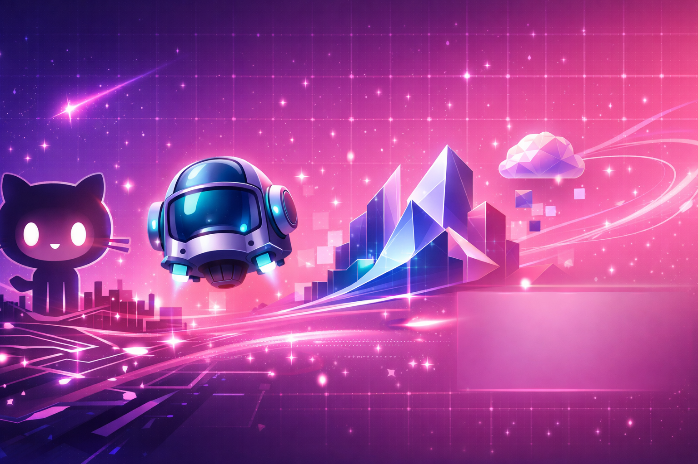

<h1 align="center">Hi, I’m Érika 👋💖</h1>

 Me gusta el rosa, las mariposas, el brilli-brilli y tener muchas plantas con flores, casi tanto como la IA Generativa, así que es normal que me chifle Copilot ✨🦋🌸  
I’m a non-technical tech storyteller: I make Copilot & GenAI feel human, fun, and usable for everyone ✨
Me encanta ser una persona no técnica hablando sobre tecnología para que todo el mundo pueda disfrutar de ella 💖  

  
  
  

## What I do (and why it’s fun) 🎤✨
Soy **Marketing & PR** en el mundo tech, y mi superpoder es hacer que la tecnología se entienda, se disfrute y se use de verdad — incluso si no vienes “del lado técnico” 💅⚡  
I speak at **Microsoft communities & technical events**, con demos, storytelling y un toque friki (because… why not?) 🪄

## Current obsessions 🤖💥
- **Microsoft Copilot** (work, life, everything)  
- **GitHub Copilot** (pair-programming pero con glitter) ✨  
- **GitHub Spark** (from idea to app, fast & cute)  
- **Azure AI** vibes: agents, RAG, search, and all the shiny things 🌟

## What you’ll find in this GitHub 📦
- 📚 **Talk content**: slides, demos, resources, speaker notes  
- 🧪 **Experiments & prototypes** (TypeScript + a bit of C#)  
- 🧩 Mini projects to make AI feel **practical, approachable & fun**

## Speaker vibe / Topics I love 🎙️
- Copilot for humans (aka people with a life) 💁‍♀️  
- GitHub Copilot & Spark: build smarter, not harder 🧠  
- Agents + natural language: “conversational magic” 🪄  
- Community, inclusion & making tech more welcoming 🌈

## Let’s collaborate 🤝
If you want a **fun joint session**, a workshop, or a community collab:
- Open an **Issue** with your idea 💡  
- Or drop a message on **LinkedIn** (my favorite internet place) 💖

## Fun facts (because yes) 🦋
- I’m the person who will add ✨ to a demo and make it memorable  
- I love inclusive events, creative content and tech that helps people  
- “Lucy” is my nickname for GenAI and I’m not changing it 😌🤖

---

⭐ If something here helps you, consider leaving a star — it feeds the brilli-brilli energy ✨
